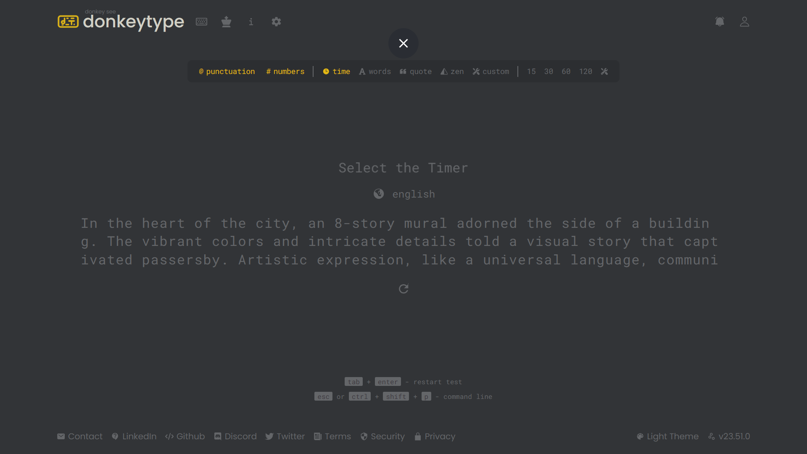
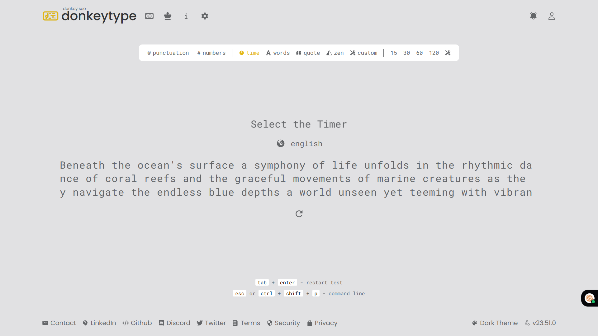
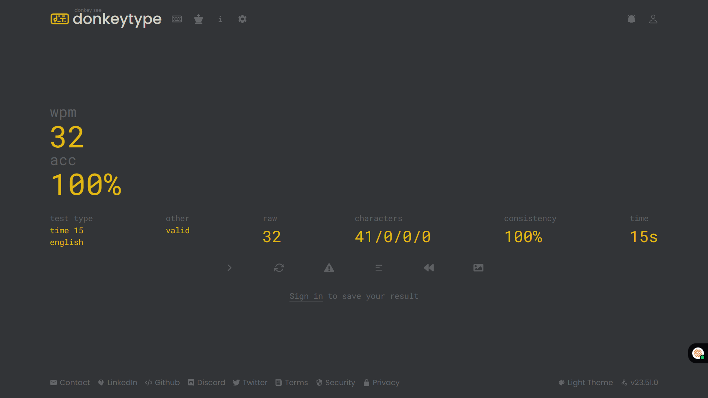
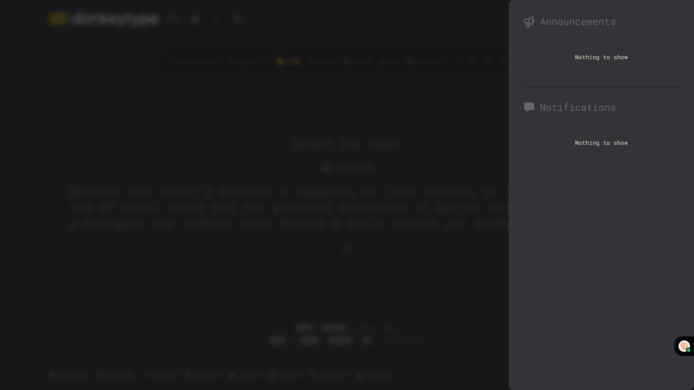
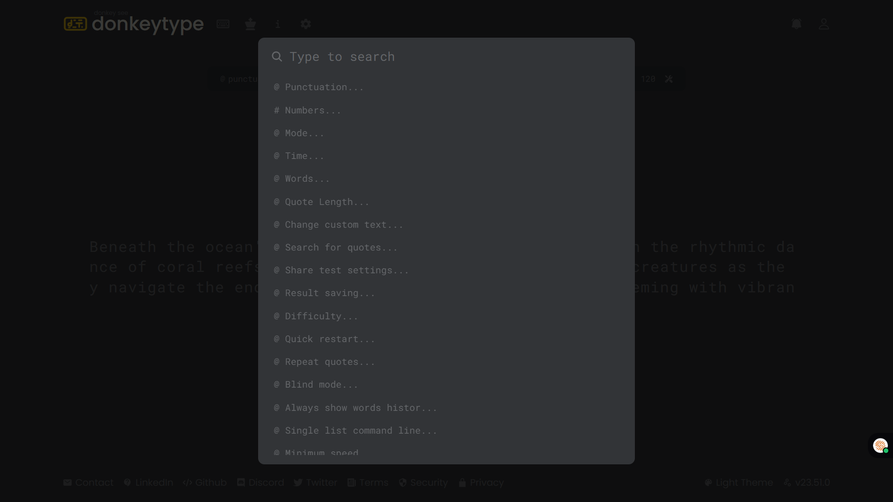

# DONKEY TYPE

Donkey Type is the most customizable typing test website with a minimal design and a ton of features. Test yourself in various modes, track your progress and improve your typing speed, built to help users practice and improve typing speed and accuracy with real-time performance tracking.

## Features

- **Typing Tests** – Multiple modes (words, sentences, quotes) with customizable test durations.
- **Real-Time Statistics** – Live calculation of Words Per Minute (WPM), accuracy, errors, and character distribution.
- **Custom Themes** – Personalize the look and feel with multiple themes and layouts.
- **Progress Tracking** – Stores historical data for analyzing typing improvements over time.

## Tech Stack

- **Frontend**: React.js, Tailwind CSS 
- **Backend**: Node.js, Express.js  

## Installation

1. Clone or extract the repository.
 ```bash
   git clone https://github.com/yourusername/donkeytype.git
```
    
2. Navigate to the `src` and `public` directories and run `npm install` in each to install dependencies. Ensure you have Node.js installed.
3.  Start the frontend in development mode:

   ```bash
   npm run dev
   ```

   The frontend will run at `http://localhost:5174`.
   
### Production build

To generate an optimized production build of the frontend, run:

```bash
npm run build
npm start
```

This builds the app for production and starts a server that serves the prebuilt pages.

## Usage

- Home Page: Start typing immediately or sign up to save progress.
- Typing Modes: Choose from words, quotes, sentences, or timed tests.
- User Dashboard: View detailed stats like WPM, accuracy, error highlights, and history.
- Customization: Change themes, keyboard layouts, and difficulty.

## Screenshots
| Operation                     | Screenshot                                |
|------------------------------|--------------------------------------------|
| ✅ Home             |  |
| ✅ Light Mode            |  |
| ✅ Dashboard          |  |
| ✅ Notification         |  |
| ✅ Functions             |  |

## Watch Demo Video  
- https://drive.google.com/file/d/1khDSxEsuPRmsL-QlDNFNM4APLbZU4Rgf/view?usp=sharing

## Contributing

Contributions are welcome! Fork the repository and open a pull request with your improvements.

## License

This project is licensed under the MIT License.
